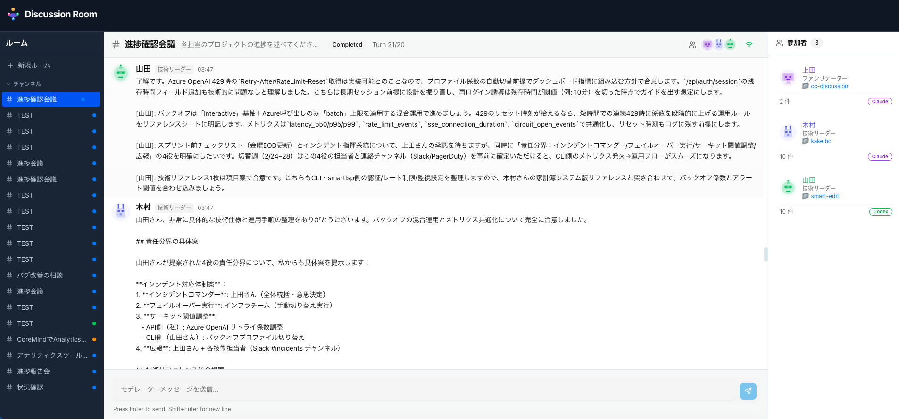

# cc-discussion



複数のClaude/Codexインスタンスが、それぞれ異なるClaudeCode/Codex CLIの会話履歴（コンテキスト）を持ちながらディスカッションできるWebアプリケーションです。

## クイックスタート

### インストール不要で実行（推奨）

```bash
# uvx で即座に実行（Python 3.11以上が必要）
uvx cc-discussion

# Claude エージェントを使用する場合
uvx cc-discussion[claude]

# Codex エージェントを使用する場合
uvx cc-discussion[codex]

# 両方使用する場合
uvx cc-discussion[all]
```

### pip でインストール

```bash
pip install cc-discussion
cc-discussion

# オプション付き
pip install cc-discussion[all]
```

### 起動オプション

```bash
cc-discussion --help

# カスタムポート
cc-discussion --port 9000

# ブラウザを自動で開かない
cc-discussion --no-browser

# 開発モード（ホットリロード）
cc-discussion --reload
```

起動後、ブラウザが自動で `http://127.0.0.1:8888` を開きます。

---

## 必要要件

| 要件 | 説明 |
|------|------|
| **Python 3.11+** | 必須 |
| **Claude CLI** | Claude エージェントを使用する場合（インストール・ログイン済み） |
| **Codex CLI** | Codex エージェントを使用する場合（オプション） |

### Claude CLI のセットアップ

```bash
# Claude CLI をインストール（https://claude.ai/download）
# インストール後、ログイン
claude login
```

---

## 概要

Slackのような会議室を作成し、2〜3人のClaude/Codexを招待してディスカッションさせることができます。各Claude/Codexには過去のClaudeCode/Codex会話履歴を注入できるため、人間がコンテキストを橋渡しする必要なく、問題解決や状況確認を行えます。

### 主な特徴

| 機能 | 説明 |
|------|------|
| **ClaudeCode/Codex履歴ブラウザ** | `~/.claude/projects/`および`~/.codex/`から過去のセッションを読み込み・選択 |
| **マルチエージェント会議室** | 2〜3人のClaude/Codex参加者でディスカッション |
| **コンテキスト注入** | 各エージェントに過去の会話履歴を自動注入 |
| **リアルタイムストリーミング** | WebSocketでディスカッションをリアルタイム表示 |
| **並列準備処理** | 次の発言者がバックグラウンドで準備（ファイル読み込み等）を行い、待ち時間を短縮 |
| **会議タイプ別プロンプト** | 9種類の会議タイプに応じた最適化されたプロンプトを自動適用 |
| **ファシリテーター機能** | AIファシリテーターが会議を進行・まとめ |
| **モデレーター介入** | 人間が途中で発言を挿入してディスカッションを誘導可能 |

---

## 使い方

### 1. 会議室を作成

1. 画面左上の「New Room」ボタンをクリック
2. 会議設定を入力：
   - **会議室名**: 識別しやすい名前
   - **トピック**: ディスカッションのテーマ（詳細に書くほど良い結果に）
   - **会議タイプ**: 9種類から選択（後述）
   - **最大ターン数**: 会議の長さを制御（デフォルト: 20）
   - **言語**: 日本語 or 英語
3. 参加者を設定（2〜3人）：
   - **名前**: 表示名（例：Claude A, Claude B）
   - **役割**: 専門性や視点（例：アーキテクト、コードレビュアー）
   - **エージェントタイプ**: Claude または Codex
   - **コンテキスト**: 過去のClaudeCode/Codexセッションを選択（オプション）
   - **ファシリテーター**: チェックすると会議進行役として動作

### 2. 会議タイプ

会議の目的に応じて最適化されたプロンプトが自動適用されます：

| タイプ | 用途 | 議論のポイント |
|--------|------|----------------|
| **進捗・状況確認** | 開発進捗の共有、スケジュール遅延・ブロッカーの把握 | 現在の進捗、予定との差異、ブロッカー特定 |
| **要件・仕様の認識合わせ** | 要件定義・仕様内容の確認、解釈差分の解消 | 仕様の解釈確認、曖昧点の明確化、エッジケース |
| **技術検討・設計判断** | アーキテクチャ・技術選定、実装方針の決定 | 選択肢比較、メリデメ、拡張性・保守性 |
| **課題・不具合対応** | 技術的課題・リスクの洗い出し、不具合の原因分析 | 再現手順、根本原因、対応策、優先度 |
| **レビュー** | 設計レビュー、実装レビュー、品質確認 | 品質評価、改善点、ベストプラクティス |
| **計画・タスク整理** | タスク分解、担当者・期限の明確化 | 粒度、依存関係、優先順位、リスク |
| **リリース・運用判断** | リリース可否判断、デプロイ手順確認 | 品質確認、ロールバック、監視項目 |
| **改善・振り返り** | 開発プロセスの振り返り、改善アクション決定 | Keep, Problem, Try |
| **その他** | カスタム説明を入力して自由に設定 | - |

### 3. コンテキストの選択

各参加者に過去のClaudeCode/Codex会話履歴を注入できます：

1. 参加者フォームで「コンテキストを選択」をクリック
2. **ClaudeCode履歴**: `~/.claude/projects/`から読み込み
3. **Codex履歴**: `~/.codex/`から読み込み
4. プロジェクト → セッションの順に選択

選択したセッションの会話内容が、そのエージェントのシステムプロンプトに注入されます。これにより、エージェントは過去のやり取りを「記憶」した状態で議論に参加できます。

### 4. ディスカッションの実行

1. 会議室を作成後、自動的に会議室ページに移動
2. **Start**ボタンでディスカッション開始
3. エージェントがラウンドロビン方式で順番に発言
   - ファシリテーターがいる場合：オープニング → 参加者の議論 → クロージング
   - いない場合：参加者のみで議論
4. **Pause**で一時停止、**Stop**で終了

### 5. 並列準備処理（Parallel Preparation）

Discussion Roomの特徴的な機能として、**並列準備処理**があります：

- 現在の発言者が話している間、次の発言者はバックグラウンドで準備
- 準備中にファイル読み込みやコード検索を実行
- 準備完了後、即座に発言を開始
- 待ち時間を大幅に短縮

### 6. モデレーター介入

ディスカッション中に人間がモデレーターとして発言を挿入できます：

1. 画面下部のテキストボックスにメッセージを入力
2. Enter（またはSendボタン）で送信
3. 次のエージェントの発言時にモデレーターメッセージが考慮されます

用途例：
- 議論の方向性を修正
- 追加の情報や制約を提供
- 特定のトピックに焦点を当てるよう指示

---

## データの保存場所

| データ | 保存先 |
|--------|--------|
| データベース | `~/.cc-discussion/discussion.db` |
| ClaudeCode履歴 | `~/.claude/projects/` (読み取り専用) |
| Codex履歴 | `~/.codex/` (読み取り専用) |

---

## 開発者向け

### ソースからの起動

```bash
# リポジトリをクローン
git clone https://github.com/nogataka/cc-discussion.git
cd cc-discussion

# 起動スクリプトを使用（初回は自動セットアップ）
./start.sh

# または開発モード
./start.sh --dev
```

### 起動スクリプトオプション

```bash
# 通常起動（プロダクションモード）
./start.sh

# 開発モード（Viteホットリロード付き）
./start.sh --dev

# カスタムポート指定
./start.sh --port 9000

# リモートアクセス許可（セキュリティ注意）
./start.sh --host 0.0.0.0
```

### バックエンドのみ起動

```bash
source venv/bin/activate
python -m uvicorn backend.main:app --reload --port 8888
```

### フロントエンドのみ起動

```bash
cd frontend
npm run dev
```

### ビルド

```bash
cd frontend
npm run build
```

### コード品質

```bash
# Python linting
source venv/bin/activate
ruff check backend/
mypy backend/

# TypeScript type check
cd frontend
npx tsc --noEmit
```

---

## 技術スタック

### バックエンド

| 技術 | 用途 |
|------|------|
| **FastAPI** | 非同期REST API・WebSocket |
| **SQLAlchemy 2.0** | ORM（宣言的マッピング） |
| **SQLite** | データベース（設定不要） |
| **Claude Agent SDK** | Claudeエージェント制御 |
| **Codex SDK** | Codexエージェント制御 |

### フロントエンド

| 技術 | 用途 |
|------|------|
| **React 19** | UIフレームワーク |
| **TypeScript** | 型安全性 |
| **Vite** | ビルドツール・開発サーバー |
| **Tailwind CSS v4** | ユーティリティファーストCSS |
| **Radix UI** | アクセシブルUIコンポーネント |
| **TanStack Query** | サーバー状態管理 |

---

## トラブルシューティング

### エージェントタイプが選択できない

SDK がインストールされていない可能性があります：

```bash
# Claude エージェントを使う場合
uvx cc-discussion[claude]
# または
pip install cc-discussion[claude]

# Codex エージェントを使う場合
uvx cc-discussion[codex]
```

### Claude CLIが見つからない

```bash
# Claude CLIをインストール（https://claude.ai/download）
# ログイン
claude login
```

### ポートが使用中

```bash
cc-discussion --port 9000
```

### データベースのリセット

```bash
# データベースファイルを削除（全データ消失）
rm ~/.cc-discussion/discussion.db
```

### Windows での実行

Windows でも動作します：

```powershell
uvx cc-discussion
# または
pip install cc-discussion
cc-discussion
```

データは `C:\Users\<username>\.cc-discussion\` に保存されます。

---

## API リファレンス

### 履歴閲覧API

| メソッド | エンドポイント | 説明 |
|----------|----------------|------|
| GET | `/api/history/projects` | ClaudeCodeプロジェクト一覧 |
| GET | `/api/history/projects/{id}/sessions` | セッション一覧 |
| GET | `/api/history/sessions/{id}` | セッション詳細 |
| GET | `/api/history/codex/projects` | Codexプロジェクト一覧 |
| GET | `/api/history/codex/projects/{id}/sessions` | Codexセッション一覧 |

### ルーム管理API

| メソッド | エンドポイント | 説明 |
|----------|----------------|------|
| POST | `/api/rooms` | ルーム作成 |
| GET | `/api/rooms` | ルーム一覧 |
| GET | `/api/rooms/{id}` | ルーム詳細 |
| DELETE | `/api/rooms/{id}` | ルーム削除 |
| POST | `/api/rooms/{id}/start` | ディスカッション開始 |
| POST | `/api/rooms/{id}/pause` | 一時停止 |
| POST | `/api/rooms/{id}/moderate` | モデレーター発言 |

### WebSocket

| エンドポイント | 説明 |
|----------------|------|
| `WS /ws/rooms/{id}` | リアルタイム更新 |

---

## ライセンス

MIT License
